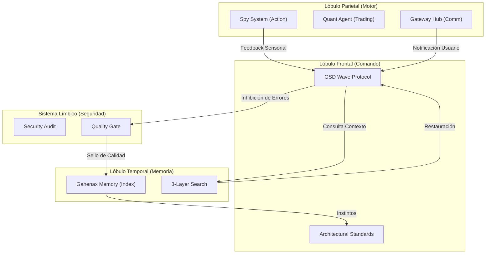
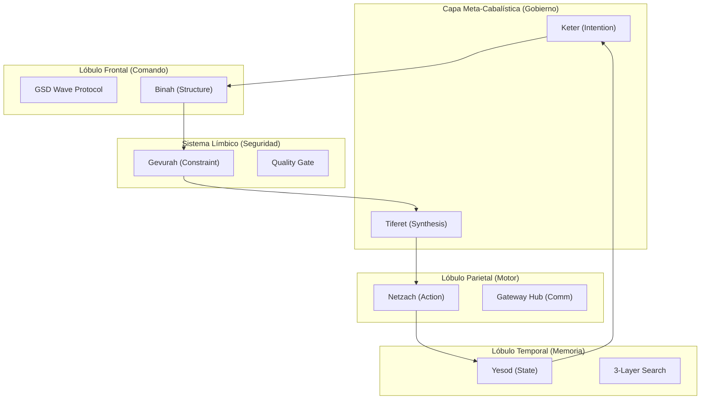

# GAHENAX CONNECTOME — Neural Architecture Mapping

Este documento formaliza la transición del ecosistema Gahenax de un conjunto de herramientas a una **Arquitectura Cognitiva** inspirada en el cerebro humano (Cortex, ISH Mapping y ML).

## Estructura Anatómica de Gahenax

### 1. Lóbulo Frontal (Corteza Prefrontal) — Ejecución y Planificación
Es el centro de control y toma de decisiones. Gestiona el razonamiento abstracto y la resolución de problemas.
- **Skills**: `gsd-wave-protocol`, `superpowers-brainstorming`, `gahenax-architect`.
- **IA Aumentada (Wave 3)**: `open-webui`, `anythingllm` (Cognición extendida).
- **Documentos**: `GAHENAX_Manual_de_Procedimientos_Comercial_v5.pdf`, `GAHENAX_Proyecto_Institucional_FINAL.pdf`.

### 2. Lóbulo Temporal (Hipocampo) — Memoria y Semántica
Gestión del conocimiento a largo plazo y recuperación de información.
- **Skills**: `gahenax-memory`, `gahenax-memory-search`, `selfhosted-rag-pipeline`.
- **Conexiones**: Recibe "inputs" de todas las áreas para indexarlas (Memory Flush).
- **Knowledge Base (Wave 3)**: Almacenamiento local en `anythingllm_data`.

### 3. Lóbulo Parietal (Corteza Motora/Somatosensorial) — Herramientas y Acción
La interfaz de Gahenax con el mundo exterior (APIs, Scrapers, Bots).
- **Gateway Hub (Wave 4)**: `gahenax-gateway-secure` (WhatsApp, Discord, Telegram).
- **Productividad (Wave 2)**: `activepieces` (Automatización), `plausible` (Analytics).
- **Gestión (Wave 4)**: `twenty-crm` (Relaciones B2B).
- **Atributos**: Manipulación de datos, ejecución de scripts, trading, comunicación multi-canal.

### 4. Lóbulo Occipital — Procesamiento Sensorial y Monitoreo
Procesamiento visual y flujo de datos en tiempo real (Telemétria).
- **Observability Stack (Wave 4)**: `grafana`, `prometheus` (Dashboards de salud).
- **Detección**: `gahenax_spy_system`, `pattern_analyzer.py`.
- **Atributos**: Visión, detección de patrones en PCAP, monitoreo de Aviator/WPlay.

### 5. Sistema Límbico (Amígdala y Cingulado) — Valencia y Seguridad
Control de calidad, ética y defensa. Reacciona ante "amenazas" (errores o vulnerabilidades).
- **Security Core (Wave 1)**: `vaultwarden` (Gestión de secretos), `gahenax-security-audit`.
- **Calidad**: `gahenax-quality-gate`, `gahenax-rulebook`, `superpowers-code-review`.
- **Atributos**: Vigilancia, detección de secretos, gating de calidad.

### 6. Tronco Encefálico — Sistema Reticular/Infraestructura
Funciones vitales básicas que mantienen al agente vivo y conectado.
- **Enterprise Forge (Wave 1)**: `gitea`, `caddy` (Ingress/HTTPS).
- **Core**: `context_inference_engine.py`, `infrastructure/`, `install_antigravity.py`.

## Sinapsis: Flujo de Señal Neural

1.  **Estímulo (Input Usuario)** -> Entra por el **Lóbulo Frontal** (Hub de Comando).
2.  **Recuperación** -> El Frontal consulta al **Temporal** (Core Semántico) para ver precedentes.
3.  **Simulación** -> El Frontal diseña el plan (GSD Wave).
4.  **Ejecución** -> Se activa el **Lóbulo Parietal** (Corteza Motora) para actuar.
5.  **Monitoreo** -> El **Occipital** (Hub Sensorial) vigila el éxito de la acción.
6.  **Validación** -> El **Sistema Límbico** (Gating de Supervivencia) autoriza el commit final.
7.  **Consolidación** -> El **Temporal** (Hipocampo) guarda la experiencia (Memory Flush).

## El Connectome: Grafo de Interacción Funcional

Utilizamos la arquitectura del **Yale Brain Atlas** para definir las rutas de alta velocidad entre "Parcelas" (herramientas específicas).

---
*Gahenax AI v3.0 — Hacia la Soberanía Digital Absoluta.*

## VII. Arquitectura Cabalística (Meta-Orquestación)

Para trascender la ejecución lineal, Gahenax utiliza un **Motor de Árbol de la Vida (Tree of Life Engine)** que orquesta los lóbulos neuro-funcionales.

| Sephirot | Función Cognitiva | Equivalencia Connectome |
| :--- | :--- | :--- |
| **Keter** | Captura de Intención | Lóbulo Frontal (Input Hub) |
| **Chokmah** | Generación de Hipótesis | IA Aumentada (Ollama/WebUI) |
| **Binah** | Estructuración del Plan | GSD Wave Protocol (Planning) |
| **Chesed** | Rutas Exploratorias | Open Discovery (Parietal Hub) |
| **Gevurah** | Validación y Bloqueo | Sistema Límbico (Quality Gate) |
| **Tiferet** | Síntesis y Decisión | Core Executive (Decision Center) |
| **Netzach** | Ejecución en el Mundo | Lóbulo Parietal (Action Hub) |
| **Hod** | Análisis de Telemetría | Lóbulo Occipital (Mirror Hub) |
| **Yesod** | Integración de Estado | Hipocampo (Memoria Corta/SQLite) |
| **Malkuth** | Emisión de Respuesta | Lóbulo Parietal (Communication) |

## El Connectome v3.0: Grafo de Interacción Funcional

## Parcellation: Funciones Específicas (334+ Términos)
- **Parcela 101 (Spy-Aviator)**: Función: *Real-time Telemetry & Reward Prediction*.
- **Parcela 205 (Tauri-Builder)**: Función: *Native Desktop Encapsulation*.
- **Parcela 309 (Quant-Binance)**: Función: *High-Frequency Order Execution*.
- **Parcela 401 (Gateway-WhatsApp)**: Función: *Secure Multi-Channel Dispatcher*.
- **Parcela 500 (Cabal-v1)**: Función: *Meta-Cognitive Orchestrator*.
