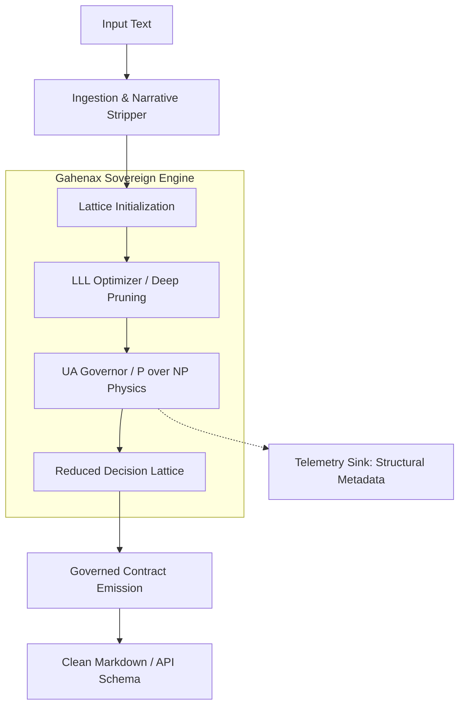

# Gahenax Core — Architecture Specification

## System Topology

## Functional Components

### 1. The Lattice Optimizer (LLL/Deep-LLL)
Reasoning is mapped as a vector space $L$. The optimizer performs unimodular transformations to find short, near-orthogonal basis vectors representing the most independent and rigorous logical paths.
- **Complexity**: $O(n^4 \log B)$ where $n$ is the number of assumptions.
- **Function**: Prunes "logical noise" and collapses redundant assumptions (`AssumptionStatus.REDUCED`).

### 2. The UA Governor
Enforces the **P over NP** paradigm.
- **Budgeting**: Prevents the LLM from entering infinite loops of "speculation" by capping Athena Units (UA).
- **Audit**: Generates a verifiable hash of the decision entropy before and after the LLL cycle.

### 3. The Contract Module
Ensures the output is always serialized into the `GahenaxOutput` schema. It acts as a final "Hardware Filter" that blocks any narrative or imperative language.

## Information Flow
1. **Selection**: User text is converted into a list of candidate `Findings` and `Assumptions`.
2. **Reduction**: The LLL algorithm reduces the assumption set.
3. **Closing**: The system generates `ValidationQuestions` only for those assumptions that survived the reduction and are necessary for the `Verdict`.
4. **Emission**: Final Markdown with UA Audit metadata.
